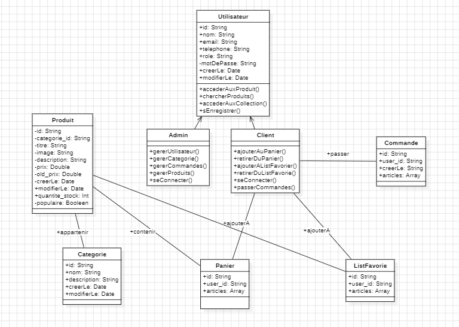
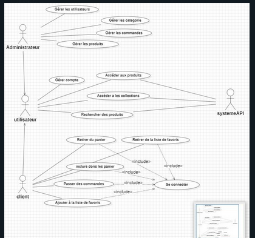
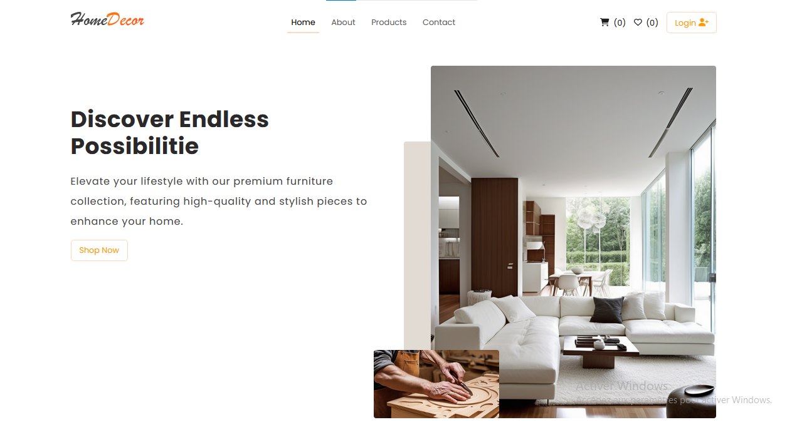
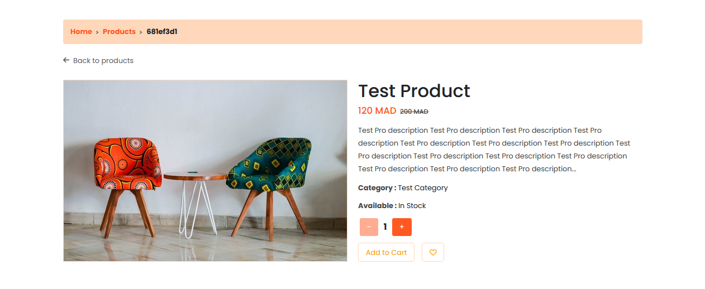
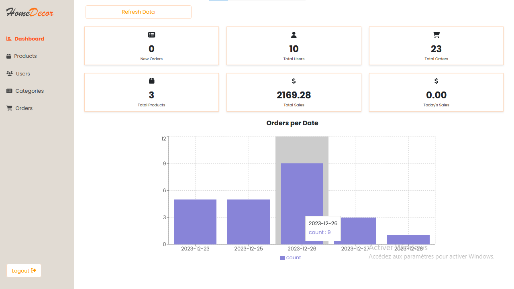
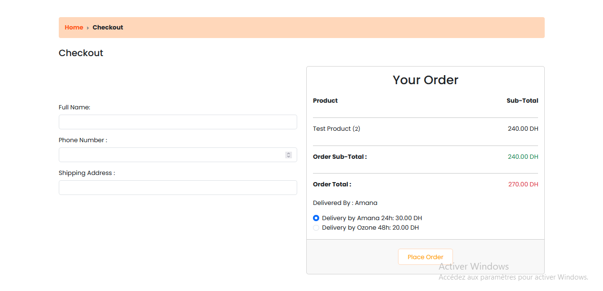

# Furniture E-commerce React App

This is a furniture e-commerce application built using React. It allows visitors to discover a vast range of products, search for them, create accounts, add products to the wishlist or cart, make orders (currently relying on Cash on Delivery), and more.

## Technologies Used

- React
- Axios
- Bootstrap
- EmailJS
- React Router
- Recharts
- ScrollReveal
- Styled-Components
- SweetAlert2
- JSON Server

## Features

- Browse and search for products
- User authentication and account creation
- Wishlist and shopping cart functionality
- Cash on Delivery payment option (with plans to implement online payment gateway)
- Admin dashboard with CRUD operations for products, users, and categories
- Order management with the ability to change order status
- Statistics chart for orders count per date

## Getting Started

### Prerequisites

- Node.js and npm installed
- JSON Server installed globally (`npm install -g json-server`)

### Installation

1. Clone the repository
  ```bash
  git clone https://github.com/Moslihbadr/E-commerce.git
  cd furniture-ecommerce-app
  ```
2. Start the React app
  ```bash
  npm install
  ```
3. Start JSON Server (for mock API)
  ```bash
  npx json-server --watch api/db.json --port 3000
  ```
4. Start the React app
  ```bash
  npm run dev
  ```
The app should be running at [localhost:5173](http://localhost:5173/).

## Configuration

### Admin Dashboard
Access the admin dashboard by logging in with admin credentials. You can use the email "tt@tt" and the password "tttt". Update the admin credentials and permissions as needed.

# UML Diagrams

## Class Diagram



## Use Case Diagram



# Screenshots

Here are some screenshots from the Furniture E-commerce React App:

## Home Page



## Product Details



## Admin Dashboard



## Checkout Page



## Contributing
Feel free to contribute to the development of this project. Fork the repository, create a branch, make your changes, and submit a pull request.

## License
This project is licensed under the MIT License - see the LICENSE file for details.
